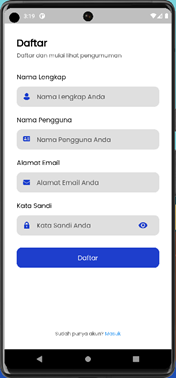
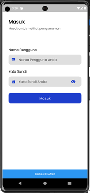
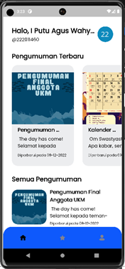
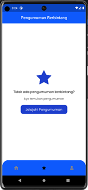
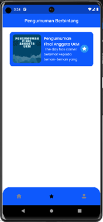
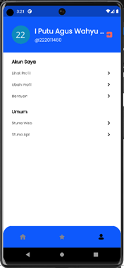
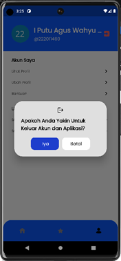
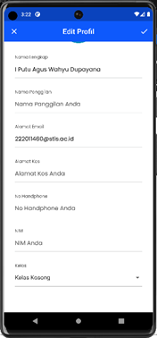
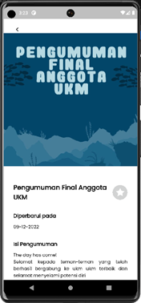

# Dokumentasi Stuna Client Cross Platform

## Description

This is the cross platform client for Stuna. This client is built with Dart and Flutter.

## Screenshots

## Tentang

Kode ini dibawah lisensi BSD 3-clause. Silahkan baca [Lisensi](LICENSE) untuk informasi lebih lanjut.

Client Cross Platform ini dibuat dengan Dart dan menggunakan framework [Flutter](https://flutter.dev/).

## Instalasi

Silahkan ikuti langkah-langkah berikut untuk menginstall Stuna Client Cross Platform.

1. Clone repository ini
2. Masuk ke direktori repository
3. Jalankan perintah `flutter pub get`
4. Jalankan perintah `flutter run`
5. Jika ingin melakukan build, jalankan perintah `flutter build`

Terdapat file env yang harus diisi dengan data-data yang dibutuhkan. Silahkan copy file `env` menjadi `.env` dan isi dengan data-data yang dibutuhkan.
